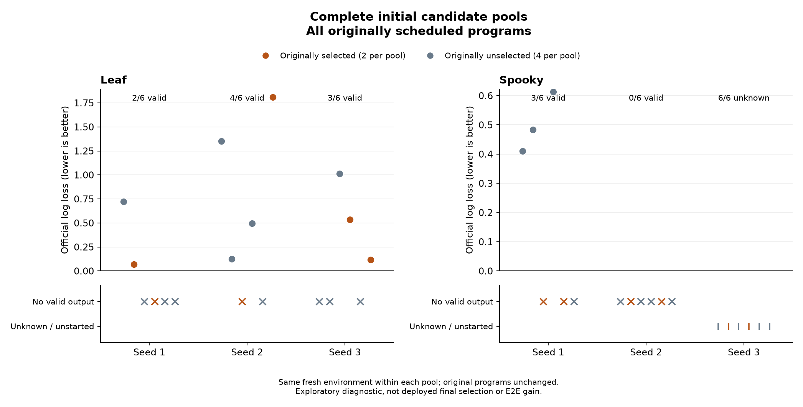

# 给学长的进展汇报：完整候选池已实测，分开供给、筛选与执行失败

更新：2026-09-19 11:44 UTC（Spooky评分于11:33 UTC完成）。ForeTS实现、训练及comparison生产归学长；以下完整池执行、独立复核和反馈修复是本轮新增工作。

**本轮已经完成30条真实程序执行，不是只做接口验收。** Leaf三个完整池、Spooky两个完整池，共12条有效、18条无有效提交；Spooky第三池六条按既定时间门未启动，不填零分。三个作业实耗合计8.738333333333333 GPU·时，零API/训练。Leaf两个明确的池内正例仍成立，但Spooky未复现，不能称稳定跨任务或E2E收益。

## 核心进展

**不再只看两条被选中的程序。** 我们把新comparison中Leaf的三个初始六候选池全部执行：18条原代码，9条得到有效提交、9条程序失败、0条基础设施未知。原选的两条也同环境重跑，未用历史成绩拼对照。两次作业均正常完成，实际5.471666666666667 GPU·时，零API、零训练。

有两处具体正信号，但总体选择优势尚未成立：

1. 三个池都存在较好的候选；不是所有候选都差、无从选择。其中两个池的原选二包含全池最优。
2. 即使原top-3第三条没有保存，枚举它的全部四种可能后，seed1、seed3的保留集合在本轮诊断下仍优于全池均匀选二。这个窄正信号不依赖补猜排名。

与此同时，seed2漏掉了明显更好的候选，必须保留，不能只报“2/3成功”。

三个池都至少两条有效，因此这次确实有条件检验“有效程序中谁更好”。09-14旧双候选复跑没有双有效池，无法回答这个问题。两批生成器、宽度和程序预算不同，不能把这个差异归因为27B更强或某个单独改动有效。

## 完整结果

任务均为Leaf，logloss越低越好。胜/平/负比较的是原选二所含程序的最佳官方成绩与全部15种均匀二选组合；无有效提交视为低于有有效提交。这是**执行后的oracle诊断，不是可部署最终提交策略，也不是E2E效果**。

| 原始seed | 六条中有效数 | 原选二有效数 | 原选二最好loss | 六条最好loss | 对15组合：胜/平/负 |
|---|---:|---:|---:|---:|---:|
| 1 | 2 | 1 | 0.06983 | 0.06983 | 10 / 5 / 0 |
| 2 | 4 | 1 | 1.80818 | 0.12444 | 1 / 2 / 12 |
| 3 | 3 | 2 | 0.11709 | 0.11709 | 10 / 5 / 0 |

缺失第三条的top-3效果边界，以`P(优于均匀二选)−P(劣于均匀二选)`度量：seed1为[0.24444,0.46667]，seed2为[-0.8,0.2]，seed3为[0.46667,0.46667]。seed2的**集合净效应**正负仍不可识别，不能从一次差抽签直接推出该净效应为负。

更细的硬筛选机制检查能确定另一件事：seed2已知保留了一条失败程序，以及四条有效程序中最差的1.80818；未知第三条最多覆盖其余三条更好程序中的一条。因此无论它是谁，**至少两条更好的有效程序已被硬筛选排除**。全部四种可能中，保留/淘汰边界的9个质量比较至少4个、最多9个方向错误。此处是保留决策相对fresh质量的比较，不是恢复出的原始critic分数，也不排除排序打平后按顺序截断。它明确不能把整个漏优现象只归因于“top-3里随机抽二”；与净效应边界跨零不矛盾。4个CPU测试通过，所有可能性完整保留。

三个池等权平均的上述边界为[-0.029629629629629645,0.37777777777777777]，跨零。仅在双方都有有效提交的组合中，原选二相对随机二选的平均loss改善，逐池再平均为-0.13997469576719576，中位为+0.2908888888888889。此条件均值的有效组合子集各池不同，不能当无条件效用；它仍说明“多赢一个池”不等于总体幅度为正。

官方评分均经独立数值核对；15组合经另一实现复算。seed3一条概率行和有最多1.850020151517029e-07偏差，引发sklearn提示，仍在事先独立检查容差内，官方与独立loss按五位一致；未归一化修改提交或覆盖分数。

### 辅助复核：正例不靠挑质量门槛，但不等于节省总成本

Leaf结果之后新增的完整分布检查，不替换原终点：对全部观测loss门槛及四种未知第三条，seed1/3的top-3随机二选获得门槛内成绩的概率均不低于全池随机二选，并在部分门槛严格更高（一阶随机占优）。seed2不成立。采用独立位掩码枚举与精确分数，6个CPU测试通过。这只强化固定已测池的效用变换稳健性，不增加样本量、不证明跨seed总体或E2E。

同时把程序耗时列入诊断，防止把质量正例直接称为效率收益：

| seed | 原选二程序耗时之和（秒） | 全池随机二选期望和（秒） |
|---|---:|---:|
| 1 | 52.79459411997232 | 303.79172901131096 |
| 2 | 1201.620721327985 | 1024.6437885316554 |
| 3 | 1090.3977174920146 | 909.8070918660184 |

这些是六路共同负载下观测的逐程序wall时间之和，**不是实测两程序策略墙钟或GPU·时**，且质量仍用事后best-of-two。seed1的原选对在该二维诊断中无组合同时更快更好；seed2/3则存在支配它的组合。对于seed3，较快但有一条失败的组合也可能保留同一最优程序，所以该oracle前沿不能直接变成可部署策略。5个额外CPU测试及均匀组合成本恒等式检查通过。

分布、质量/成本和硬筛选三个辅助分析在Spooky新成绩读取前已固定，沿同一代码报告，不根据其结果换指标；Leaf上均明确为事后诊断。

## 跨任务复核：Spooky没有复现优势，已区分两种瓶颈

按读分前固定的`forets-1` seed1、2、3顺序执行；14099正常完成，1960秒、六GPU，实耗3.2666666666666666 GPU·时。只启动前两池；第三池不满足剩余至少7500秒的门槛，整池未启动，无续跑或替换。Leaf来自`forets`目录，Spooky来自`forets-1`目录；各自固定池内比较，不把目录命名、任务或历史生产环境差异当成已控制的跨任务因果效应。

| 原始seed | 六条中有效数 | 原选二有效数 | 六条最好loss | 对15组合：胜/平/负 |
|---|---:|---:|---:|---:|
| 1 | 3 | 0 | 0.40975 | 0 / 3 / 12 |
| 2 | 0 | 0 | 无有效提交 | 0 / 15 / 0 |
| 3 | 未启动 | 未知 | 未知 | 不计算 |

两种失败机制不能混为一谈：

- **seed1有可用供给，但被筛掉。** 原选两条均失败，其余四条中三条有效。即使未知第三名是有效程序，top-3随机抽二获得至少一条有效提交的概率也最多2/3，低于全池随机二选的4/5；第三名无效则概率为0。因此“有效提交概率受损”对全部四种第三名均成立，不只是一次抽签不好。连续质量的集合净效应范围仍跨零，不把有效性结论偷换成所有质量效用均为负。
- **seed2整个候选池没有有效提交。** 在这六条原程序内，任何只重排候选的critic都无法产生有效提交；这不能靠提高当前池排序准确率解决。结论不外推为整个生成器或后续debug必然无效。

官方logloss与独立数值核验通过；独立15组合、第三名边界、完整CDF、质量成本及筛选边界分析均沿用预先固定代码。三个有效提交中最大概率行和偏差1.200000001588819e-07，在原容差内，未改提交或重算成不同口径。

九条失败均有具体程序异常线索：错误正则、LogisticRegression/TfidfVectorizer不存在的参数、liblinear多分类不适用、Booster缺少classes_和未定义model。本次不是程序超时，也未见GPU架构或内核未就绪标记；缺失标记本身不证明所有环境问题均排除。进一步对四条原选程序核对原生产日志，**同代码的终端报错在历史记录中逐条一致（4/4）**，所以不能把原选全失败只解释成此次fresh重跑造成的变化。没有修复候选后重试，没有更换任务镜像。

一个容易误报的细节：Spooky seed1原选两条仅约30秒就失败，在“质量—执行时间”二维诊断里仍可能处于非支配位置；这绝不是效率收益。只有真实同资源的有效最终成绩提高，才是方法收益。

## 一个影响解读的实际故障

seed1中原来已选的最好候选，历史120秒时因“内核未就绪”失败，却附加了“程序超过两小时时限”。同一代码SHA在此次fresh环境约38秒完成，loss0.06983。生产源码确认未就绪返回发生在候选代码执行之前。

整批43个可读run、957个已执行非根节点中发现16条同类标记，涉及11个run；两种方法都有。我们已修正本分支的阶段报错，5个回归测试通过，但**未部署到本轮实验、未修复历史启动根因、未删除失败节点**。不能把所有旧失败都解释成基础设施；详情见[运行诊断](COMPARISON_RUNTIME_FINDING_20260919.md)。

## 同时确认的成本约束

历史25个完整初始池中，最慢一次生成请求均长于原选两程序执行时间之和；Leaf逐池比值中位数5.12。客户端时延包含排队和重试，且不少程序快速失败，不能当独占GPU服务时间或直接宣称缩小生成宽度能提速。其意义是：后续必须计入本地生成成本，不能默认只省执行就改善总预算质量。详[成本报告](COMPARISON_COST_FINDING_20260919.md)。

## 对下一轮的实际裁决

- 不直接大规模重训或扩展昂贵E2E。已有“池内有好方案且部分能选中”的实测信号，值得检验跨任务，但尚不值得宣称稳定收益。
- Spooky复核已按上表闭合，不自动补跑第三池来追求正结果。准备阶段状态输出变量错误及一次传输中断均在提交前处理，没有失败GPU重投。
- 历史完整critic排名未随包提供；不把现在重新打分当成原排名。共享盘0918目录两次当前视图为空，只能说我方未看见可下载文件，不判断是否已上传但未共享。
- 跨任务一致优势没有通过，因此不直接扩大现有硬淘汰策略或大规模重训。正向投资点应区分“保住池内好候选”和“产生可执行候选”：下一轮若比较保留未选候选的有限回退，必须对照原方法、固定总资源、真实完整执行，并计入生成和debug成本；本轮没有验证这一干预有效，也不把它单独宣称新颖方法。

非阻塞的协作信息：若还保留日志，请提供这批comparison所用critic的checkpoint身份，以及每池六候选的分数/完整排序与node ID对应关系；没有也请明确即可，无需补造或重跑。当前已读配置/源码未给出可核对的critic权重身份，不能由我方现有8B权重推断它就是这批生产模型，也不需要再次发送任何密钥。这个信息影响后续同模型E2E复现，不阻塞当前“原选二”完整池比较。

廉价critic/昂贵验证、宽度自适应、执行重叠均已有强相关工作，不能单独作为novelty，详[相关工作边界](COMPARISON_NOVELTY_CHECK_20260919.md)。这轮带来的价值是补上真实反事实执行、保住两个可靠池内正例，并在两个任务上区分筛选漏优与供给不可用；它还不是顶会级完整主张。

## 可复核资产

- 合并结果：`results/comparison_pool_20260919/combined/summary.json`，SHA `41e42fbff91ca970e8f5ee19a1ffdf57c31ffe0ddd6a24182e5e304c1225ef4f`。
- Spooky：`results/comparison_spooky_pool_20260919/summary.json`，SHA `721f995ca597568303f65c32e9d04667bcdd173c174b2e6af99bb78e765c0eb1`；同目录包含独立组合、边界、图及脱敏异常证据。未启动六条保留原身份和未知状态。
- 同目录`pool-summary.csv`按原始run一行；`runs.csv`按程序一行；`independent-pairs.json`与`topk-bounds.json`给独立核验和所有可能性。
- 作业14087执行seed1/2，1888秒；原时间门未启动seed3。单独披露的续跑14091仅补seed3，1395秒，绝未重跑1/2；合计18条全部落盘。
- 原superimage、gpu28/RTX3090、每程序6CPU/7200秒。统一fresh-container不同于历史Jupyter/硬件，不冒称历史环境复现。
- 保护first960/Target300/522未读取；未更新agent底座，未动学长分支，未公开原始程序/凭据。
