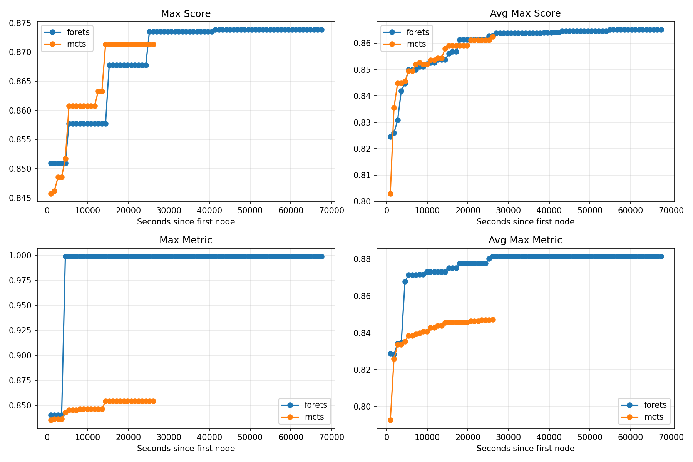
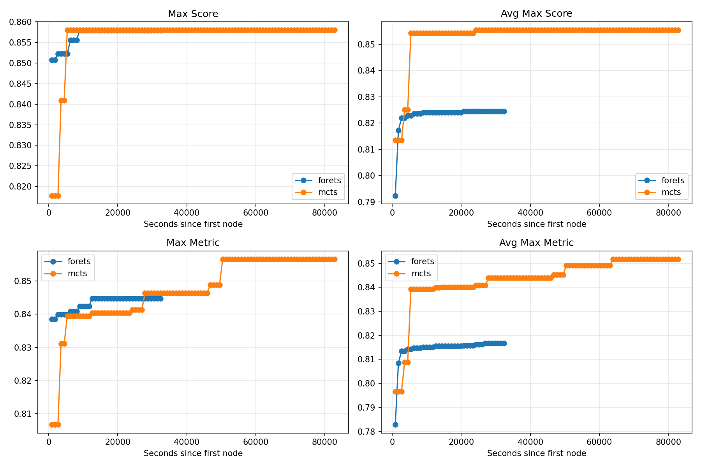
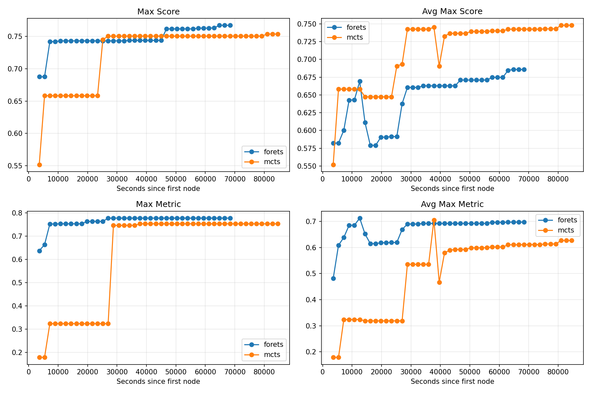

# RL judger 重跑、0905 数据与第一次端到端试验（截至 9 月 11 日）

## 这版报告回答什么

这份报告承接 0828 版，记录三件事：

1. 修完 RL 数据和 prompt 的 bug 之后，在 0827 的 experiment 切分 value pair 上重跑 TRL RL，并把最好的 14B checkpoint 分别拿到 decision pair 和 value pair 上重新评估；
2. 数据升级到 0905 版本（包含更多 MLEBench 任务、并按树深度控制 pair）之后，轻量 predictor、BT 和 verl RL 的结果；
3. 第一次把 BT critic 接进真实搜索流程，用 fore_ts 在三个任务/时间预算上做的端到端对比。

### 结果的定位

第 1、2 节的 accuracy 是 **proxy 指标**，只说明数据里有没有可学信号、训练目标是否有效、模型规模是否值得继续投入。它们不是 critic 有用的证明。

第 3 节才是 end-to-end：固定计算预算，看 critic 能否改善真实搜索过程和最终成绩。这轮只有三个任务、每组 3–6 个 seed，任务和时间预算都是事后挑的，所以它同样是探索，不是结论。

## 1. RL judger：修完 bug 后在 0827 value pair 上重训

### 1.1 这次改了什么

0819 那次是在 experiment 切分的 value pair 上训 RL，结论是 RL 训不过普通 BT：14B RL 最高约 59%，而 BT 8B 有 64.11%。

这次有三处变化：

- 训练数据换成 0827 的 experiment 切分 value pair；
- 修了 RL prompt 的 bug。原来的写法是把每个任务第一份 journal 里的 constraints 当成整个任务的常量，同一个任务的不同 run 如果换了硬件或时间限制，模型就会被要求在错误的条件下判断 solution。修完之后，prompt 里直接写两条候选各自的 `execution_timeout` 和 `hardware`，缺字段时直接报错。
- 训练基建

完整训练配置和奖励曲线在
https://wandb.ai/zizhechen-the-chinese-university-of-hong-kong/mle-critic-rl/reports/mle-critic-rl---VmlldzoxNzkxMzA0Ng

### 1.2 训练结果

**只有 14B 实现了性能提升，但最高只到 0.6；其他规模没有显著收益。**

和 0819 那次相比，修 bug 加换数据让"RL 完全训不出来"变成"14B 能训出一点东西"，但收益停在 BT 模型早就到过的水平上，而且没有随规模稳定放大。

### 1.3 decision pair 上的评估

用来评估的是 value pair 上训出来的 14B RL checkpoint。在 decision pair 测试集（1328 条）上：

| 评估对象 | temperature | 采样数 | 准确率 |
| --- | ---: | ---: | ---: |
| RL 14B | 0 | 1 | 49.92% |
| RL 14B | 1 | 1 | 52.18% |

两个温度下都非常糟糕，t=0 时 1328 条里有 7 条没解析出答案，准确率按解析成功的 1321 条算。

作为对照，同一份 decision 测试集（1332 条）上，用 0827 value pair 训出来的普通 BT 模型是：

| BT 模型 | 准确率 |
| --- | ---: |
| Qwen3-0.6B | 55.93% |
| Qwen3-1.7B | 54.73% |
| Qwen3-4B | 56.38% |
| Qwen3-8B | 58.33% |

这两张表要放在一起看。RL 模型是在 value pair 上训的，拿去做 decision pair 算是 OOD 评估，但上面的 BT 模型同样只在 value pair 上训过，它们在同一个 decision 测试集上都有 55%–58%。所以 RL 掉到 50% 附近不是"OOD"造成的：同一个训练目标、同一份训练数据换成 BT 之后，迁移到 decision 的能力明显更强。

### 1.4 value pair 上的温度和 majority voting

同一批 value pair 测试集（2633 条）上，把 RL 14B 的采样温度和投票数都试了一遍：

| temperature | 采样数 | 准确率 |
| ---: | ---: | ---: |
| 0.5 | 1 | **60.31%** |
| 1.0 | 1 | 59.25% |
| 0.5 | 4（多数投票） | 59.89% |
| 1.0 | 4（多数投票） | 59.67% |

**提高温度和多数投票都不如低温一次采样**，多采样没有换回任何收益。

对应的 BT 对照（0827 value 测试集 2637 条，seed1 的 checkpoint）是：

| BT 模型 | 准确率 |
| --- | ---: |
| Qwen3-0.6B | 56.66% |
| Qwen3-1.7B | 57.07% |
| Qwen3-4B | 59.12% |
| Qwen3-8B | **60.90%** |

### 1.5 结论

1. decision pair 上，RL 14B 的 49.9%/52.2% 不但远低于 BT 8B 的 58.3%，甚至低于 BT 0.6B 的 55.9%；
2. value pair 上，RL 14B 的最好成绩 60.31%（低温一次采样）仍然低于 BT 8B 的 60.90%；
3. RL 这边的推理成本更高：它要先生成一段分析再作答，不是一次前向出一个分数。

**无论是 decision pair 还是 value pair，RL 都还没有打过一个比较好的 8B BT checkpoint，而且是花了更多训练和推理成本之后仍然没打过。** 但是把人类先验知识或外部框架训练为基模能力是一个最优雅的方案（也是所有的大厂都在做的），所以我会继续以不同方式探索RL这个方向，而e2e则暂时用bt模型找找感觉。

## 2. 0905 数据：更多任务 + 控制树深度

### 2.1 这版数据改了什么

1. 包含更多 MLEBench 任务，覆盖面变大；
2. 构造 pair 时控制两端节点的树深度相差不超过 1，按 `abs(left.tree_depth - right.tree_depth) <= 1` 过 pair（原来的默认是不做这个过滤）。

第二点的动机是：如果 pair 的一端是搜索树里很浅、很粗糙的节点，另一端是深挖过的节点，那么"哪个更好"这件事里混进了"谁被迭代得更多"，模型学到的可能不是 solution 本身的质量。限制深度差是为了去掉这个混淆。

### 2.2 轻量 predictor

| 数据版本 | 测试集大小 | TF-IDF LR | static LR | static GBM |
| --- | ---: | ---: | ---: | ---: |
| 0827（对照） | 2637 | 59.88% | 56.20% | 57.87% |
| 0905 全量 | 3061 | 55.93% | 56.84% | 57.37% |
| 0905 不限深度 | 1781 | 53.73% | 55.81% | 57.21% |
| 0905 控制深度 | 1408 | 55.75% | 54.76% | 56.75% |

`static_lr` 和 `static_gbm` 只用 34 个手工统计特征（代码长度、结构、执行情况等），不是文本模型。

结果确实进一步减弱了：轻量模型从 0827 的 57%–60% 掉到 0905 的 54%–57%。两个细节：

- 0827 和 0905 的测试集不是同一批 pair（2637 条 vs 3061/1781/1408 条），这个下降里同时混了"数据变了"和"测试集变了"；
- 0905 内部，控制深度相比不限深度只对 TF-IDF 有帮助（55.75% vs 53.73%），对手工特征模型基本没有影响（static GBM 57.22% → 56.75%）。

### 2.3 BT 训练

两个 seed、五个规模的最好 validation accuracy（测试集 1408 条）：

| 模型 | seed 6 | seed 7 |
| --- | ---: | ---: |
| Qwen3-0.6B | 51.49% | 54.40% |
| Qwen3-1.7B | 55.82% | 54.76% |
| Qwen3-4B | 57.53% | 55.47% |
| Qwen3-8B | 53.34% | 59.38% |
| Qwen3-14B | **57.81%** | **60.01%** |

和 0827 数据上的 BT 相比（0827 最好的 8B 是 60.90%，1–4B 在 57%–59%），**0905 数据上 BT 的整体水平也下降了**，而且两个 seed 不一致：

- seed 7 有比较清楚的 scaling：0.6B 的 54.40% 一路涨到 14B 的 60.01%；
- seed 6 看不出 scaling：8B（53.34%）掉到 4B（57.53%）以下，14B（57.81%）也没有比 4B 高多少。

"换更多任务 + 控制深度"之后，proxy 上不管是轻量模型还是大模型都变弱了，scaling 的迹象还是那个老问题：**换一个 seed 就不复现。**

### 2.4 用 verl 在控制深度的数据上做 RL

在同一份控制深度的数据上用 verl 又跑了一次 RL：**30 步训练提升微小。**

数据本身难、数据/代码结构不好、训练方法不对，这三者现在还分不开。

## 3. 第一次端到端：fore_ts + 8B BT critic

### 3.1 流程

MCTS 正常走到一个叶子节点，然后：

1. 并行生成 n 个候选 solution；
2. 用 BT critic 给这 n 个候选逐一打分；
3. 保留分数最高的 k 个；
4. 从这 k 个里随机抽 m 个真正执行；
5. 执行结果照原来的 MCTS 流程回传、进入 debug。

critic 只影响"生成出来的候选里执行哪几个"，不改变代码怎么执行、怎么 debug、怎么打分。用的是 0827 数据训出来的 8B BT 模型。对照的基线是没有 critic 的普通 MCTS。

### 3.2 第一组：us-patent-phrase-to-phrase-matching，7200s，n=8, k=4, m=2

图例里蓝线是加了 critic 的组（5 个 run），橙线是普通 MCTS 基线（6 个 run）。

橙线的 Max Score 涨得更快，约 1.4 万秒就到 0.872 并走平；蓝线要到约 2 万秒才到 0.873，最后两条线基本重合。所以**上升速度上 critic 组没有优势，最终分数只高一丝**。蓝线在 Max Metric / Avg Max Metric 上更高。橙线在约 2.7 万秒就停了，没有跑完全程。

0.87 这条线已经是金牌水平，这个任务在 7200s 的预算下本来就接近饱和，所以它不适合用来检验 critic。

### 3.3 第二组：us-patent-phrase-to-phrase-matching，3600s，n=8, k=1, m=1

7200s 那组的 solution 运行时间设成了 3600s，跟训练数据不一致（训练数据里 us-patent 的拿牌率很低，主要就是 3600s 造成的），所以把这组重做成 3600s，并且把 k 和 m 都压到 1。

两条线的 Max Score 都停在 0.858 附近，**都没有突破铜牌线 0.861**。k=1、m=1 意味着每个节点只执行一个候选，蓝线（critic 组）的 Avg Max Score 被一个跑坏的 run 拖到 0.824 上下，橙线在 0.853 上下。

归因到"evaluation 时 BT 模型在 us-patent 上表现差"是有数据支持的：8B BT 模型在该任务的 pair accuracy 是 124/228 = 0.544，基本是略好于瞎猜。一个在任务上只有 0.54 的 critic，在同一个任务里做 e2e 筛选，没有收益是预期内的。

### 3.4 第三组：AI4Code，10800s

前两个任务都不合适，所以换成 BT 模型 offline 评估较好的 AI4Code（该任务 pair accuracy 28/40 = 0.700）。这组实验还在跑。

橙线是 mcts 基线，蓝线是 critic 组。目前 critic 组在 Max Metric 和 Avg Max Metric 上高一些（约 0.78 vs 0.75、约 0.69 vs 0.62 并在上升），Max Score 只有微弱优势（约 0.751 vs 0.768），但 Avg Max Score 上橙线更高（约 0.75 vs 0.67，主要原因是forets的seed5表现奇差）。也就是说"微弱优势"只出现在部分指标上，而且两条线覆盖的时间不一样（蓝线到约 5.4 万秒，橙线到约 8.8 万秒）。

### 3.5 结论

三组实验暂时不能支撑任何结论：

- 前两个任务选得不好：一个已饱和，一个 critic 本身只有 0.54;
- 第三个任务是事后挑的、实验还没跑完、指标之间还不一致；
- 三组实验的分组里 seed 数不一样，第二组的基线是另一台机器/另一个用户跑的 run，多了一个混淆项。

现在唯一明确的结论是：**critic 接进 e2e 的流程已经跑通了**。同时这轮还确认了一个trick——在选任务之前先看 offline 的 per-task accuracy，但其实这种技巧是不公平的。