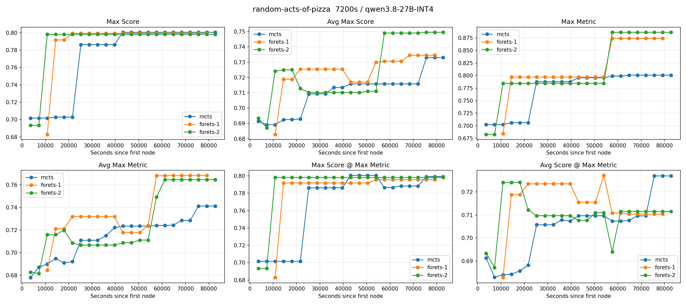
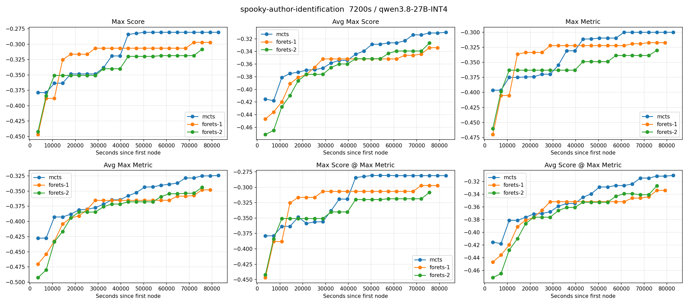
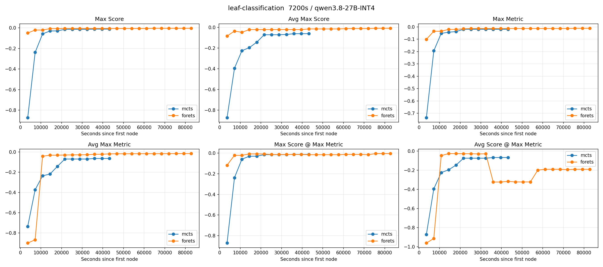
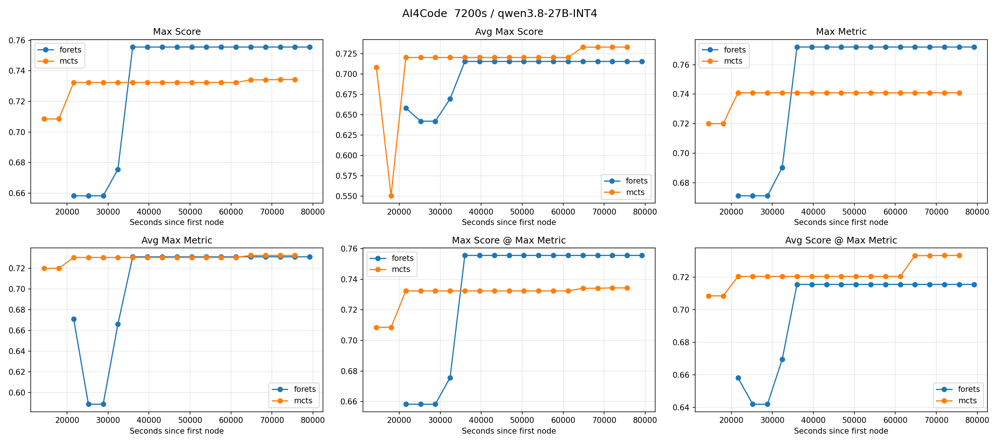
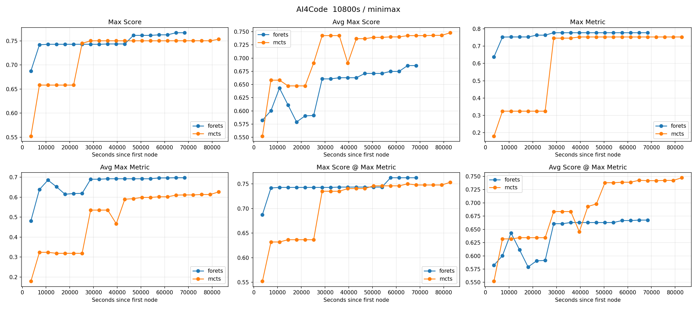
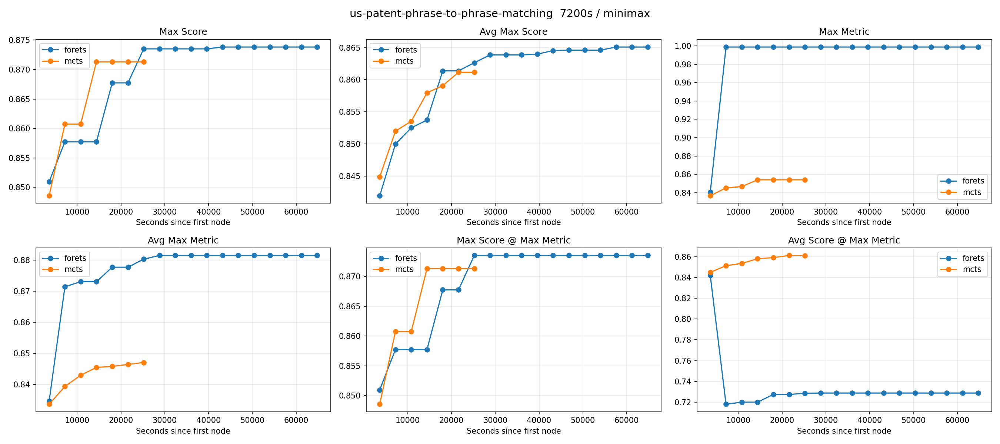
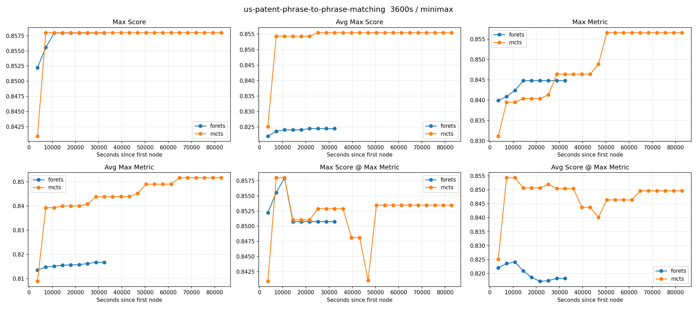
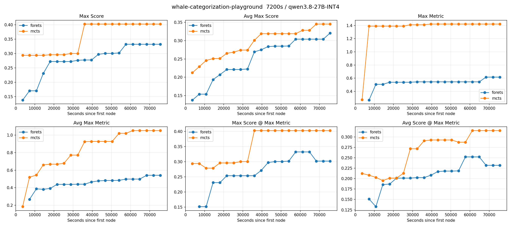
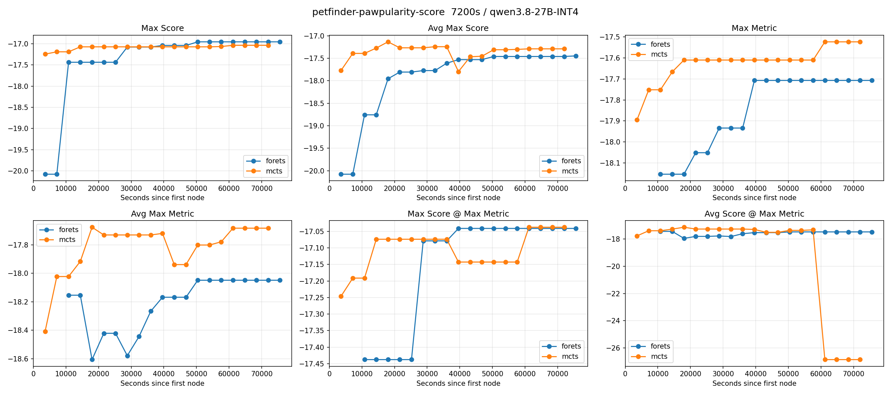

# VERL 端到端分析与数据假说（截至 9 月 18 日）

## 这版报告回答什么

这份报告承接 0911 版。本版记录三件事：

1. 换成 VERL 的 GRPO 做 RL 之后，Qwen3.8-27B 训出来的 critic 第一次在 proxy 上超过了 BT 训出来的 critic；
2. 在 critic 的基础上又挑了几个任务做 ForeTS vs MCTS 的端到端对照（一共 9 组配对，分本地部署 qwen 和 API 的 minimax 两批）。结论是 ForeTS 没有优势：9 组里 MCTS 赢 8 组，而且从曲线上能直接看到 critic 在迎合内部指标（metric hacking）的迹象；
3. 数据从 0815 一路演化到 0916 的过程中，BT 的训练 loss 平台抬高、eval 准确率下降。把 (模型, seed) 配对之后趋势依然成立，倾向于解释成"数据变难"而不是"数据构建坏了"，并列出能把这个判断钉死的几个实验。

### 结果的定位

第 1 节的 accuracy 是 **proxy 指标**：它只回答“给同一个任务、同一次实验里的两条 submission，模型能不能挑出实际分数更高的那条”。它不能说明 critic 接进真实搜索流程之后能提高 MLEBench 成绩——那要固定计算预算的端到端实验，目前还没做。

第 2 节是真正的端到端对照（ForeTS vs MCTS）。这一节的结果统一用 `journal_to_fig.py` 从每个 run 的 journal 里聚合出来的曲线（2.1 有定义和用法），并给这个脚本加了两张专门监测 metric hacking 的图。

第 3 节是从 BT 训练日志里读出来的趋势，里面所有跨版本的准确率都对不上同一个测试集，所以只能当"现象 + 假说"，不能当结论。

## 1. 第一次：RL critic 打过 BT critic

训练配置（wandb 里 `GRPO-Qwen3_8-27B-work-0905data` 那组 run）：

| 项 | 值 |
| --- | --- |
| 卡 | 8×H200，单节点 |
| 模型 | Qwen3.8-27B，全参训练（FSDP2 + ulysses sequence parallel 2） |
| 算法 | GRPO，每个 prompt 采 8 条，每步 64 个 prompt（= 512 条序列/步） |
| 步数 | 计划 3 epoch = 492 步，实际跑到第 90 步左右被打断 |
| 学习率 | 1e-6，constant |
| KL | 没有。`use_kl_in_reward=False`、`kl_loss_coef=0`，policy 不锚在初始模型上，也没有 entropy bonus |
| clip | 0.2 |
| 长度 | prompt、response 上限各 32768 token |
| 采样 | 训练 temperature 1、top_p 1；验证 temperature 0、每条采 1 次 |
| 数据 | 训练 10,409 条判断 prompt，验证约 1,395 条（从验证准确率的分母反推，同一份测试 pair 少了几条） |

结果：https://wandb.ai/zizhechen-the-chinese-university-of-hong-kong/mle-critic-verl/reports/RL-BT--VmlldzoxNzk1OTQ3MA

BT 这边，0905 数据、验证集 1,408 条 pair，三个 seed 的最好 validation accuracy：

| 模型 | seed 1 | seed 6 | seed 7 |
| --- | ---: | ---: | ---: |
| Qwen3-0.6B | 54.12% | 51.49% | 54.40% |
| Qwen3-1.7B | 53.84% | 55.82% | 54.76% |
| Qwen3-4B | 53.05% | 57.53% | 55.47% |
| Qwen3-8B | 56.61% | 53.34% | 59.38% |
| Qwen3-14B | 54.97% | 57.81% | **60.01%** |

RL 这边，验证集约 1,395 条 pair：

| 训练步 | 5 | 10 | 15 | 20 | 25 | 30 | 35 | 40 | 45 |
| --- | ---: | ---: | ---: | ---: | ---: | ---: | ---: | ---: | ---: |
| val acc | 56.20% | 56.99% | 56.85% | 54.77% | 57.99% | 61.15% | 60.43% | 61.08% | 59.00% |

| 训练步 | 50 | 55 | 60 | 65 | 70 | 75 | 80 | 85 | 90 |
| --- | ---: | ---: | ---: | ---: | ---: | ---: | ---: | ---: | ---: |
| val acc | 62.87% | 61.94% | 63.01% | 62.51% | 62.22% | 62.22% | 62.15% | **63.37%** | 62.65% |

**最高 63.37%（第 85 步），比 BT 最好的 60.01% 高 3.4 个点。** 

## 2. ForeTS vs MCTS：第二轮 cherry-pick 的对照实验

### 2.1 评估口径：journal 里聚合出来的六条曲线

这一节的结果统一用 `src/dojo/analysis_utils/journal_to_fig.py` 得到：它直接读每个 run 的 `checkpoint/journal.jsonl`，按时间聚合成曲线。

**不用 `results/grading_report.json`**，原因是那个文件在每评一个节点时就被覆盖写一次（`src/dojo/tasks/mlebench/task.py` → `evaluate.evaluate_submission(..., results_output_dir)`），存下来的是"最后一个被评过的 submission"，不是 solver 最后会提交的那个 best node——只有正常跑完的 run 才会在最后用 best node 再评一次把它覆盖掉。而这些 run 基本都跑不完：集群有 24 小时限制，翻 srun 的 stderr 全是 `CANCELLED ... DUE TO TIME` 或 allocation 到期，67 次 attempt 里没有一次打出过 solver 自己的 `Maximum runtime reached` 或 `Final fitness`。所以那个数测的是"最后一步落在哪"，和我们关心的"这次搜索找到了什么"是两件事。

这次给脚本加了两样东西：

- `--text`：把曲线打成纯文本表，这样不用画图也能读，也方便贴进报告和做 diff；
- 两张新图，专门用来盯 metric hacking。

脚本现在输出六条曲线（下面的名字就是文本模式里的列名）：

| 曲线 | 含义 |
| --- | --- |
| `max_score` | 所有 run 里出现过的**最高官方分数**（到该时刻为止） |
| `avg_max_score` | 每个 run 各自的最好官方分数，再在 run 之间取平均 |
| `max_metric` | 同上，但用的是搜索自己的**内部验证指标** |
| `avg_max_metric` | 同上，内部指标、按 run 平均 |
| `max_selected_score`（新） | 每个 run 按**内部指标**挑出的那个节点（也就是 solver 停下时会提交的节点）的官方分数，再在 run 之间取最大 |
| `avg_selected_score`（新） | 同上，按 run 平均 |

后两条的用途：把 `max_metric` 和 `max_selected_score` 放在一起看，缺口就是"内部指标认为很好、但官方分数并不好"的程度，也就是 hacking 的大小。同理 `avg_max_score` 和 `avg_selected_score` 之间的差，衡量的是"内部指标排序能不能可靠地挑出最终要提交的那个节点"。

### 2.2 这轮实验的设置

两个 solver 都是 MCTS，区别只在"一个节点展开时怎么选候选"：

| | 每个节点生成几个候选 | critic 打分后保留几个 | 实际执行几个 |
| --- | ---: | ---: | ---: |
| MCTS | 2 | — | 2 |
| ForeTS | 6 | top-3 | 从 top-3 里随机抽 2 |

也就是说 **两边最终执行的都是 2 个候选**，ForeTS 多花 3 倍的生成来换"挑哪 2 个执行"。critic 是 0827 数据训的 8B BT（如果记错了请纠正我）。

因为一次要生成 6 个候选，我们把生成模型换成本地部署的 Qwen3.8-27B-INT4（2×3090，6 并发下约 200 tps），这样打分和生成的额外开销还能接受。所有 run 的预算是：`time_limit_secs = 86400`（24 小时）、`execution_timeout = 7200`（单次 solution 最多跑 2 小时）、`step_limit = 10000`。

这轮新挑的任务是 AI4Code(7200)、leaf-classification、random-acts-of-pizza、spooky-author-identification，另外还有 whale-categorization-playground 和 petfinder-pawpularity-score；上周的 us-patent（7200 / 3600）和 AI4Code(10800) 也一起算了进来。其中 **pizza / spooky / leaf / AI4Code 7200 / whale / petfinder 用本地部署的 qwen3.8-27B-INT4，us-patent 和 AI4Code 10800 用 minimax API**，两批生成速度差很多，所以结果表里标了生成模型。

### 2.3 挑任务用的信号本身有多硬

挑任务用的是 0827 数据训出来的 8B BT critic 的 per-task pair accuracy：

| 任务 | value pair（pair 数） | decision pair（pair 数） |
| --- | --- | --- |
| whale-categorization-playground | 74/96 = 0.771 | 22/32 = 0.688 |
| random-acts-of-pizza | 25/32 = 0.781 | 7/15 = 0.467 |
| spooky-author-identification | 80/105 = 0.762 | 54/84 = 0.643 |
| leaf-classification | 58/78 = 0.744 | 64/105 = 0.610 |
| AI4Code | 28/40 = 0.700 | 10/18 = 0.556 |
| petfinder-pawpularity-score | 43/86 = 0.500 | 44/57 = 0.772 |
| （上周）us-patent | 124/228 = 0.544 | 32/47 = 0.681 |
| 全体 | 1606/2637 = **0.609** | 0.583（1332 条） |

**这些数字的问题是样本量太小。** per-task 只有 15–228 条 pair，1σ 的标准误是 3–7 个点：pizza 的 25/32 = 0.781，95% 区间大约是 0.62–0.90；AI4Code 的 28/40 = 0.700，区间是 0.56–0.84。也就是说"这个任务的 critic 有 0.78"和"这个任务的 critic 只有 0.60"在我们的数据量下根本分不开。

更麻烦的是**按观测值挑任务这件事本身**：观测准确率 = 真值 + 噪声，挑最高的几个等于在挑噪声最大的几个，它们的真值会往全局平均（0.609）回归。所以"先看 offline 的 per-task accuracy 再挑任务"这个做法，用现在的数据规模是挑不出东西的——0911 那轮已经吃过一次亏，这轮是第二次。

### 2.4 结果

主表是六条曲线各自的最后一个点，数字都是**原始指标**的方向；粗体是同一任务中最好的。"run 数"写成"有 journal 的 run / 目录里的 run"，因为有几个 run 被 kill 时还没写出 checkpoint journal（只有 `json/JOURNAL.jsonl`，里面没有官方分数，用不了）。

| 任务 | arm | 生成模型 | run 数 | max_score | avg_max_score | avg_selected_score |
| --- | --- | --- | ---: | ---: | ---: | ---: |
| random-acts-of-pizza（越大越好） | MCTS | qwen（本地） | 6/6 | 0.8005 | 0.7330 | **0.7270** |
| random-acts-of-pizza | ForeTS-1 | qwen | 5/5 | 0.7993 | 0.7345 | 0.7104 |
| random-acts-of-pizza | ForeTS-2 | qwen | 5/5 | 0.7982 | **0.7495** | 0.7116 |
| spooky（log loss，越小越好） | MCTS | qwen | 6/6 | **0.2808** | **0.3097** | **0.3105** |
| spooky | ForeTS-1 | qwen | 5/5 | 0.2971 | 0.3340 | 0.3340 |
| spooky | ForeTS-2 | qwen | 5/5 | 0.3084 | 0.3267 | 0.3267 |
| leaf-classification（log loss，越小越好） | MCTS | qwen | 4/4 | 0.0120 | 0.0601 | **0.0670** |
| leaf-classification | ForeTS | qwen | 3/3 | **0.0039** | **0.0081** | 0.1901 |
| AI4Code 7200（越大越好） | MCTS | qwen | 2/4 | 0.7343 | **0.7333** | **0.7333** |
| AI4Code 7200 | ForeTS | qwen | 2/3 | **0.7555** | 0.7156 | 0.7156 |
| AI4Code 10800（越大越好） | MCTS | minimax | 4/4 | 0.7534 | **0.7480** | **0.7473** |
| AI4Code 10800 | ForeTS | minimax | 5/5 | **0.7669** | 0.6858 | 0.6674 |
| us-patent 7200（越大越好） | MCTS | minimax | 6/6 | 0.8713 | 0.8612 | **0.8611** |
| us-patent 7200 | ForeTS | minimax | 5/5 | **0.8738** | **0.8651** | 0.7288 |
| us-patent 3600（越大越好） | MCTS | minimax | 2/3 | **0.8580** | **0.8554** | **0.8496** |
| us-patent 3600 | ForeTS | minimax | 5/5 | 0.8579 | 0.8245 | 0.8182 |
| petfinder（RMSE，越小越好） | MCTS | qwen | 5/8 | 17.038 | 17.292 | 26.856 |
| petfinder | ForeTS | qwen | 5/6 | **16.956** | 17.448 | **17.478** |
| whale（越大越好） | MCTS | qwen | 4/4 | **0.4028** | **0.3452** | **0.3152** |
| whale | ForeTS | qwen | 3/3 | 0.3323 | 0.3207 | 0.2318 |

几点直接可以读出来的：

- **whale 上是 MCTS 明显更好**（max_score 0.4028 vs 0.3323，avg_selected_score 0.3152 vs 0.2318）。
- **petfinder 上两边都还没拿到牌，但 MCTS 的 `avg_selected_score` 是 26.86**——那 5 个 run 里有一个（seed 1）内部指标选中的节点官方 RMSE 是 **65.0**，而它自己跑出过的最好成绩是 17.19。这一条就把平均分彻底带跑了，也是"内部指标选不出最后提交节点"的又一个例子（2.5 第一点）。
- **us-patent 两个预算上，两边的最好成绩基本一样**（7200：0.8713 vs 0.8738；3600：0.8580 vs 0.8579），差别全在平均口径上。
- **AI4Code 7200 和 10800 上，ForeTS 的 `max_score` 反而略高**（0.7555 vs 0.7343、0.7669 vs 0.7534），但 `avg_max_score` / `avg_selected_score` 都是 MCTS 高 5–8 个点。也就是说 ForeTS 的方差更大：最好的那个 run 更好，但典型水平更差。

*图 2-1　random-acts-of-pizza，7200s，qwen3.8-27B-INT4；三个 arm（mcts / forets-1 / forets-2）。y 轴越大越好。*

*图 2-2　spooky-author-identification，7200s，qwen3.8-27B-INT4；三个 arm。原始指标是 log loss，图上已经取负，所以同样是越大越好。*

*图 2-3　leaf-classification，7200s，qwen3.8-27B-INT4；mcts 组只跑到约 12 小时，forets 组跑到约 23 小时。原始指标是 log loss，图上已取负。*

*图 2-4　AI4Code，7200s，qwen3.8-27B-INT4；forets / mcts 两个 arm，各 2 个 run（目录里分别是 3 / 4 个 run，其余没写出 checkpoint journal），样本量小。越大越好。*

*图 2-5　AI4Code，10800s，minimax；forets（5 个 run）对 mcts（4 个 run）。MCTS 的曲线明显更陡：它 24 小时跑了 127 步，ForeTS 只跑了 27 步（见 2.5 第四点）。越大越好。*

*图 2-6　us-patent-phrase-to-phrase-matching，7200s，minimax；forets（5 个 run）对 mcts（6 个 run）。ForeTS 的 `max_metric` 冲到 0.999 而 `max_score` 停在 0.874，是这几张图上最明显的 hacking；MCTS 的两条线基本贴在一起。*

*图 2-7　us-patent-phrase-to-phrase-matching，3600s，minimax；forets（5 个 run）对 mcts（2 个 run）。这个预算下任务不再饱和，两边的 `max_score` 基本一样。*

*图 2-8　whale-categorization-playground，7200s，qwen3.8-27B-INT4；forets 3 个 run、mcts 4 个 run。越大越好；注意这个任务的 `max_metric`（1.4 量级）和官方分数（0.4 量级）根本不是一个量纲，所以在图上 MCTS 的 metric 曲线高不代表它分数高。*

*图 2-9　petfinder-pawpularity-score，7200s，qwen3.8-27B-INT4；forets（5 个 run）对 mcts（5 个 run，目录里共 8 个）。原始指标是 RMSE，图上已取负，所以越大越好；右下角 MCTS 在 5 小时附近掉到 -65 的那个点就是 seed 1 选错节点。*

### 2.5 从六条曲线里能读出来的几件事

**第一，把内部指标和官方分数摆在一起，hacking 是看得见的。**

下面这两张表是新增曲线的直接用途。第一张是 `max_metric` 和 `max_score` 的差距（只在两个数同量纲的任务上有意义）：

| 任务 | arm | max_metric | max_score | 差 | 方向 |
| --- | --- | ---: | ---: | ---: | --- |
| random-acts-of-pizza | MCTS | 0.8008 | 0.8005 | 0.000 | 基本相等 |
| random-acts-of-pizza | ForeTS-1 / ForeTS-2 | 0.8739 / 0.8860 | 0.7993 / 0.7982 | **0.075 / 0.088** | 内部指标虚高 |
| us-patent 7200 | MCTS | 0.8540 | 0.8713 | 0.017 | 官方分数更高 |
| us-patent 7200 | ForeTS | 0.9989 | 0.8738 | **0.125** | 内部指标虚高 |
| us-patent 3600 | MCTS | 0.8566 | 0.8580 | 0.001 | 基本相等 |
| us-patent 3600 | ForeTS | 0.8448 | 0.8579 | 0.013 | 官方分数更高 |
| AI4Code 10800 | MCTS / ForeTS | 0.7534 / 0.7779 | 0.7534 / 0.7669 | 0.000 / 0.011 | 相等 / 指标虚高 |
| AI4Code 7200 | MCTS / ForeTS | 0.7409 / 0.7719 | 0.7343 / 0.7555 | 0.007 / 0.016 | 内部指标虚高 |
| spooky（log loss） | MCTS | 0.3001 | 0.2808 | 0.019 | 内部指标更差 |
| spooky（log loss） | ForeTS-1 / ForeTS-2 | 0.3173 / 0.3302 | 0.2971 / 0.3084 | 0.020 / 0.022 | 内部指标更差 |
| leaf-classification（log loss） | MCTS / ForeTS | 0.0196 / 0.0116 | 0.0120 / 0.0039 | 0.008 / 0.008 | 内部指标更差 |
| petfinder（RMSE） | MCTS / ForeTS | 17.52 / 17.71 | 17.04 / 16.96 | 0.49 / 0.75 | 内部指标更差 |

两个 ForeTS 的 pizza run 和 us-patent 7200 的 run 上，内部指标比实际能拿到的最好成绩好 7.5–12.5 个点，而同一个任务上 MCTS 这个差是 0–1.7 个点。这正是"critic 挑出来的候选更会迎合内部指标、但不更能解决任务"的直接证据。（whale 上这两个数差得更离谱——metric 1.42 vs score 0.40——但它们根本不是一个量纲，不能相减解读，只能在任务内部横比。）

第二张表是 `avg_max_score` 和 `avg_selected_score` 的差距，也就是"按内部指标排序、最终交出去的那个节点，比这次搜索找到过的最好节点差多少"：

| 任务 | arm | avg_max_score | avg_selected_score | 差距（交出去的更差） |
| --- | --- | ---: | ---: | ---: |
| petfinder（RMSE） | MCTS | 17.292 | 26.856 | **9.56** |
| leaf-classification（越小越好） | ForeTS | 0.0081 | 0.1901 | **0.182** |
| us-patent 7200 | ForeTS | 0.8651 | 0.7288 | **0.136** |
| whale | MCTS / ForeTS | 0.3452 / 0.3207 | 0.3152 / 0.2318 | 0.030 / 0.089 |
| random-acts-of-pizza | MCTS / ForeTS-1 / ForeTS-2 | 0.7330 / 0.7345 / 0.7495 | 0.7270 / 0.7104 / 0.7116 | 0.006 / 0.024 / 0.038 |
| us-patent 3600 | MCTS / ForeTS | 0.8554 / 0.8245 | 0.8496 / 0.8182 | 0.006 / 0.006 |
| leaf-classification（越小越好） | MCTS | 0.0601 | 0.0670 | 0.007 |
| spooky | MCTS / ForeTS-1 / ForeTS-2 | 0.3097 / 0.3340 / 0.3267 | 0.3105 / 0.3340 / 0.3267 | 0.001 / 0 / 0 |
| us-patent 7200 | MCTS | 0.8612 | 0.8611 | 0.000 |
| AI4Code 10800 | MCTS / ForeTS | 0.7480 / 0.6858 | 0.7473 / 0.6674 | 0.001 / 0.018 |

结论很清楚：**"用内部指标挑最终提交的节点"这一步本身就不可靠**，光这一个环节就能吃掉十几个点：

- us-patent 7200 的 ForeTS seed 4：内部指标最好的节点是 0.9989，官方分只有 **0.1885**（这个 run 自己跑出过 0.8621），典型的验证集泄漏；
- petfinder 的 MCTS seed 1：内部指标选中的节点官方 RMSE 是 **65.0**，而它跑出过 17.19；
- leaf-classification 的 ForeTS 有一个 seed：选中的节点官方 log loss 0.543，另外两个 seed 是 0.024 / 0.004。

**第二，换了这个口径之后，ForeTS 反而在每个能对比的任务上都略输给 MCTS，而且现在能确认不是噪声。**

用 `avg_selected_score`（每个 run 会提交的那个节点的官方分数，再在 run 之间平均）对比，9 组配对里 MCTS 赢 8 组：

| 任务 | 生成模型 | MCTS | ForeTS-1 | ForeTS-2 | 重复之间 | ForeTS − MCTS | 谁更好 |
| --- | --- | ---: | ---: | ---: | ---: | ---: | --- |
| random-acts-of-pizza（越大越好） | qwen | 0.7270 | 0.7104 | 0.7116 | 0.0012 | −0.0166 | MCTS |
| spooky（越小越好） | qwen | 0.3105 | 0.3340 | 0.3267 | 0.0073 | +0.0235 | MCTS |
| leaf-classification（越小越好） | qwen | 0.0670 | 0.1901 | — | — | +0.1231 | MCTS |
| AI4Code 7200（越大越好） | qwen | 0.7333 | 0.7156 | — | — | −0.0177 | MCTS |
| petfinder（RMSE，越小越好） | qwen | 26.856 | 17.478 | — | — | −9.38 | **ForeTS** |
| whale（越大越好） | qwen | 0.3152 | 0.2318 | — | — | −0.0834 | MCTS |
| AI4Code 10800（越大越好） | minimax | 0.7473 | 0.6674 | — | — | −0.0799 | MCTS |
| us-patent 7200（越大越好） | minimax | 0.8611 | 0.7288 | — | — | −0.1323 | MCTS |
| us-patent 3600（越大越好） | minimax | 0.8496 | 0.8182 | — | — | −0.0314 | MCTS |

（差值符号按任务方向读：越大越好的任务里负值说明 ForeTS 差，越小越好的任务里正值说明 ForeTS 差。）

唯一 ForeTS 赢的 petfinder 是靠对方翻车换来的：MCTS 有一个 run 提交了 RMSE 65 的节点（见第一点）。换成 `avg_max_score` 看，ForeTS 在 pizza、leaf、us-patent 7200 上更好（0.7345/0.7495 vs 0.7330；0.0081 vs 0.0601；0.8651 vs 0.8612），其余 6 组还是 MCTS 更好；换成 `max_score` 看，AI4Code 两个预算都是 ForeTS 略高。

两个值得注意的地方：

1. **这个差距不是噪声。** 两个独立的 ForeTS 重复之间只差 0.0012（pizza）和 0.0073（spooky），而 ForeTS 和 MCTS 的差是 0.017–0.024，是前者的 2–4 倍。之所以现在能分辨这个量级的差异，是因为 `avg_selected_score` 每条曲线用了一个 run 里约 20 个节点的信息（单个节点的分数从上面那张图也能看出来抖得厉害）。**也就是说 MCTS 领先 1.7–2.4 个点这件事是稳的，不是被噪声盖住的。**
2. **leaf-classification 上的 0.12 主要来自一个 run。** ForeTS 三个 seed 里有一个的内部指标最好的节点，官方 log loss 是 0.543（另外两个是 0.024 / 0.004），拖垮了平均；那个任务上内部指标和官方分数几乎不相关，选错是必然的。另外 leaf 的 MCTS 组只跑到 12 小时，ForeTS 跑了 23 小时，MCTS 用一半的时间还是赢了。

AI4Code(7200) 是唯一一个方向不一致的：`max_score` 上 ForeTS 更高（0.7555 vs 0.7343），但 `avg_max_score` / `avg_selected_score` 上 MCTS 更高（0.7333 vs 0.7156）。而且这里每边只有 2 个 run，样本太小，先不当结论。

**第三，挑任务用的信号和 e2e 结果不相关。**

- critic 看着最好的 pizza（0.781）反而输；
- spooky（0.762）和 leaf（0.744）也输；
- AI4Code（0.700）两种读法方向还不一致（`max_score` 上 ForeTS 高、`avg_selected_score` 上 MCTS 高），而且两边的绝对水平都离拿牌很远；
- petfinder 的 value pair 只有 0.500（等于瞎猜），e2e 也是平的；
- whale 的 0.771 和 pizza 的 0.781 几乎一样，但一个是 MCTS 赢一倍、一个是打平——offline 分数连"哪个任务会有差别"都预测不了；
- 上周按 0.544 挑的 us-patent 同样是打平。

结论就是：per-task pair accuracy 目前完全不能预测 e2e 收益，"用 offline 分数挑任务"这条路走不通。

**第四，机制上 ForeTS 换到的东西比预期少。**

在同样的时间预算里，ForeTS 实际跑完的节点更少。用每个 run 的 `checkpoint/state.json` 里的 `current_step / running_time` 算步速，再按生成模型分开看（因为本地部署和 API 的速度差很多）：

| 任务 | 生成模型 | MCTS steps/小时 | ForeTS steps/小时 | 比值 |
| --- | --- | ---: | ---: | ---: |
| random-acts-of-pizza | qwen（本地） | 1.47 | 0.95 / 0.98 | 0.65 / 0.67 |
| spooky | qwen | 1.36 | 1.24 / 1.15 | 0.91 / 0.85 |
| leaf-classification | qwen | 1.54 | 1.58 | 1.03 |
| AI4Code 7200 | qwen | 0.95 | 1.00 | 1.05 |
| petfinder | qwen | 1.12 | 0.80 | 0.71 |
| whale | qwen | 1.20 | 1.02 | 0.85 |
| **qwen 合计** | | **1.27** | **1.09** | **0.86** |
| AI4Code 10800 | minimax（API） | 5.33 | 1.30 | 0.24 |
| us-patent 7200 | minimax | 1.70 | 1.11 | 0.65 |
| us-patent 3600 | minimax | 1.52 | 1.64 | 1.08 |
| **minimax 合计** | | **2.85** | **1.35** | **0.47** |

  这张表回答了一个具体问题：**"ForeTS 节点更少"是不是本地部署太慢造成的？不是。** 本地 qwen 的 forets/mcts 步速比是 0.86，minimax API 那边是 0.47，但 API 那三个数里 AI4Code 10800 是离群点（MCTS 24 小时跑了 127 步、5.33 步/小时）；把它去掉，API 那边的比值是 0.65 / 1.08，平均 0.87，和本地几乎一样。所以这个代价主要来自"每次要多生成 4 个候选"本身，而不是换成本地模型。

  真正被本地部署影响的是**绝对速度**：MCTS 用 API 是 1.5–5.3 步/小时，换成本地 qwen 掉到 0.95–1.54。而 ForeTS 两边都差不多（1.0–1.6），说明它本来就已经被生成卡住了，换更慢的生成端不会再加倍伤害。pizza 上就是最直观的例子：同样的 20 小时，MCTS 执行了约 30 个 solution，ForeTS 只有约 19 个。leaf-classification 是唯一 ForeTS 不吃亏的任务（1.03），因为那个任务单次执行本身很慢，生成不是瓶颈。
- 还有一个从来没被验证过的前提：同一个模型在同一个节点上采 6 次，这 6 个候选的质量差异必须足够大，critic 才有东西可挑。现在没有任何数据支持这一点——没被选中的候选我们从来没执行过。这是判断这条路有没有上限的最便宜的实验，可惜现在没人做。

### 2.6 小结和下一步

这轮能确定的结论：**9 组可对比的配对里，按"每个 run 会提交的节点的官方分数"算，MCTS 赢 8 组（差距 1.7–13.2 个点），ForeTS 只在 petfinder 上赢，而那一组是 MCTS 自己提交了一个 RMSE 65 的节点造成的。** 两个独立的 ForeTS 重复之间只差 0.1–0.7 个点，说明这个差距不是噪声。另外，ForeTS 在 pizza 和多组 us-patent 上把内部指标刷高了 7.5–12.5 个点却没有换来官方分数，这是 critic + 内部指标一起被 hack 的直接证据。

下一步我建议按这个顺序：

1. **把"选最终提交节点"这一步修好**：现在这一步完全依赖内部指标排序，光这一环就能吃掉十几个点（us-patent 0.136、leaf 0.182）。可以考虑：给内部指标加一个上限/异常检测来过滤虚高的节点、用 critic 的分数和内部指标做一个一致性检查、或者干脆在最后几个候选上真的跑一遍再选。
2. **直接量化"候选之间差多少"**：ForeTS 已经把没被执行的候选存进了 `checkpoint/journal_for_unselected.jsonl`（带完整代码），把这些候选离线跑一遍，就能得到两个数：同一节点 6 个候选的分差分布，以及 critic 的 top-3 有没有真的把最好的圈进去。如果 6 个候选本来就差不多，那问题不在 critic，而在候选生成的多样性；如果差很多但 critic 圈不中，才轮到改 critic。
3. 如果确认候选差异大：优先提高候选生成的多样性（提高 temperature、换 prompt 模板、或者同一节点混用不同模型），而不是继续在 critic 的打分头上加数据。
4. 如果要做"用计算换 performance"，先看清楚时间花在哪：pizza 这类任务 20 小时里执行只占 1–2 小时，剩下的都在生成和打分上，所以 6 路生成确实是实打实的代价；反过来 us-patent 那种任务执行占 80% 以上，多生成几乎免费，ForeTS 才是"白捡"的。也就是说 **ForeTS 的性价比和任务的执行耗时强相关**，这一点比选任务时的 critic 分数更有预测力。

## 3. 数据假说：BT 变差是"数据变难"还是"数据坏了"

### 3.1 现象

把这条数据演化链上的 BT 训练日志放在一起看（`logs/augmented_mle_critic/` 下的 0815 → 0916），最明显的是训练 loss 的平台整体上移、eval 准确率整体下移：

| 数据版本 | run 数 | 任务数 | 训练 pair | 验证 pair | 首个 eval acc | 最好 eval acc | 末个 eval acc | 首 → 最好 | 末 10 步 train loss |
| --- | ---: | ---: | ---: | ---: | ---: | ---: | ---: | ---: | ---: |
| 0815 | 10 | — | 11,946 | 1,574 | 0.5473 | **0.6276** | 0.6235 | +8.0 点 | **0.3773** |
| 0819 | 4 | — | 14,206 | 1,998 | 0.5265 | 0.6117 | 0.6081 | +8.5 点 | 0.3906 |
| 0827 | 8 | 42 | 18,370 | 2,637 | 0.5413 | 0.5856 | 0.5804 | +4.4 点 | 0.3859 |
| 0905 | 15 | 64 | 10,683 | 1,408 | 0.5090 | 0.5551 | 0.5473 | +4.6 点 | 0.5464 |
| 0916 | 10 | 68 | 10,547 | 1,407 | 0.5161 | 0.5799 | 0.5730 | +6.4 点 | 0.5674 |

三个现象都在表里：loss 平台从 0.38 抬到 0.55–0.57；最好准确率从 0.628 掉到 0.555 上下；训练过程中的提升也从 +8 个点掉到 +5–6 个点。

0916 这版现在两个 seed 都跑齐了（10 个 run，5 个尺寸 × seed 6/7），把它的水位单独看：**它和 0905 基本是同一个水平**（最好准确率 0.5799 vs 0.5551，train loss 0.5674 vs 0.5464），而两者离 0815 都很远。这两个版本的数据差别也确实很小：任务数 64 → 68，训练 pair 10,683 → 10,547，主要改动是去掉了 0905 那个"两端树深度差 ≤1"的过滤。所以现在的模式是：**0815 一个台阶，0827 一个台阶，0905/0916 一个台阶**，而 0905 和 0916 的差别小到看不出来。

这张表本身不能直接下结论，因为每个版本的模型/seed 组合不一样（0815 有 5 个尺寸 × 2 seed，0819 只有 4 个 run，0905 有 15 个）。所以下面把 **(模型, seed) 配对**着看。0815、0905、0916 三个版本有完整的 seed 6 和 seed 7，先看 seed 6：

末 10 步 train loss / 最好 eval accuracy（seed 6）：

| 模型 | 0815 | 0905 | 0916 |
| --- | ---: | ---: | ---: |
| Qwen3-0.6B | 0.4249 / 0.5921 | 0.5876 / 0.5149 | 0.6144 / 0.5800 |
| Qwen3-1.7B | 0.4030 / 0.5940 | 0.5707 / 0.5582 | 0.5853 / 0.5686 |
| Qwen3-4B | 0.3915 / 0.6156 | 0.5700 / 0.5753 | 0.5652 / 0.5963 |
| Qwen3-8B | 0.3304 / 0.6601 | 0.5441 / 0.5334 | 0.5304 / 0.5785 |
| Qwen3-14B | 0.3564 / 0.6652 | 0.5102 / 0.5781 | 0.4937 / 0.6020 |

再和 seed 7 一起看（每个格子里是 train loss / 最好准确率）：

| 模型 | seed | 0815 | 0819 | 0827 | 0905 | 0916 |
| --- | --- | ---: | ---: | ---: | ---: | ---: |
| Qwen3-0.6B | 7 | 0.4615 / 0.5921 | 0.4439 / 0.6031 | 0.4301 / 0.5726 | 0.5856 / 0.5440 | 0.6018 / 0.5693 |
| Qwen3-1.7B | 7 | 0.3886 / 0.6194 | 0.4235 / 0.5956 | 0.4058 / 0.5878 | 0.5447 / 0.5476 | 0.6008 / 0.5721 |
| Qwen3-4B | 7 | 0.3902 / 0.6404 | 0.3575 / 0.6071 | 0.3666 / 0.5855 | 0.4846 / 0.5547 | 0.5723 / 0.5785 |
| Qwen3-8B | 7 | 0.3137 / 0.6391 | 0.3374 / 0.6411 | 0.3594 / 0.5878 | 0.5175 / 0.5938 | 0.5692 / 0.5899 |
| Qwen3-14B | 7 | 0.3126 / 0.6576 | — | — | 0.5548 / 0.6001 | 0.5405 / 0.5636 |

配对之后结论清楚多了：**两个 seed 都呈现同一件事——5 个模型的 train loss 从 0815 到 0916 全部上升（seed 7 的幅度 0.14–0.26，seed 6 的幅度 0.14–0.21），最好准确率掉了 2–9 个点。** 也就是说这不是被模型组合变化带出来的假象，也不是单个 seed 的偶然。

### 3.2 这条链上数据到底改了什么

| 版本 | 训练 pair | 验证 pair | 任务数 | 共同任务上的 pair 数 | 每任务训练 pair（中位数，当前数据） |
| --- | ---: | ---: | ---: | ---: | ---: |
| 0815 | 11,946 | 1,574 | — | — | — |
| 0819 | 14,206 | 1,998 | — | — | — |
| 0827 | 18,370 | 2,637 | 42 | 62.8（测试侧） | — |
| 0905 | 10,683 | 1,408 | 64 | 29.7（测试侧） | 133 |
| 0916 | 10,547 | 1,407 | 68 | 25.6（测试侧，42 个共同任务） | 133 |

几个可以直接量出来的变化：

1. **任务数一路涨：42 → 64 → 68**（0827 → 0905 → 0916）。现在（0916 数据）训练文件里有 68 个任务、10,547 条 pair，最大单任务占比 4.8%、前 5 大任务占 19.2%、归一化熵 0.95 —— 分布确实相当平均，不再被少数几个大任务主导。0905 和 0916 之间只差 4 个任务，这也是这两个版本水位接近的原因。
2. **每个任务的 pair 被摊薄了。** 0827 是 18,370 条 pair / 42 个任务，现在 10,547 条 / 68 个任务，中位数只有 133 条/任务，最少的任务只有 11 条。摊到测试侧更明显：42 个共同任务上每条任务的 pair 数从 62.8（0827）掉到 29.7（0905）、25.6（0916）。

### 3.3 为什么我倾向于"数据变难"而不是"数据坏了"

**先说支持"变难"的证据：**

1. **在同一批任务上，准确率确实掉了。** 把 0827 / 0905 / 0916 的 8B BT 在 42 个共同任务上对齐：**0.6090 → 0.5612 → 0.6059**。也就是说 0905 那次下降在去掉深度过滤之后基本回来了，剩下的差距主要是"任务变多、每任务样本被摊薄"，而不是老任务的 pair 本身变脏了。
2. **新加的任务上，8B BT 基本是瞎猜**：0905 新增的 22 个任务只有 79/159 = 0.497，0916 新增的 4 个任务是 18/32 = 0.5625。注意 0.497 是**高于** 0.5 的一点点，不是显著低于 0.5——如果标签被搞反了，我们应该看到接近 0 而不是 0.50。这更像"模型在这些任务上还没学到东西"（每个任务只有几十条 pair）。
3. **loss 抬到 0.55–0.57，但离 ln2 = 0.693 还有距离。** 也就是说模型在每个版本上都仍然是学到了东西的，只是学得越来越少；数据"坏掉"的话更常见的表现是 loss 直接顶到 0.693 附近、准确率贴住 0.5。

**再说必须排除的替代解释：**

1. **每个版本的验证集都不一样**，所以上面所有跨版本的准确率都不能直接比。要证明"数据变难"，最干净的做法是冻结一套跨版本都不在训练集里的测试 pair，每个版本的模型都在这一套上评。现在做不到（老版本的 pair 文件在仓库里是 Git LFS 指针，读不到原始数据），这一块要么补，要么就只能承认准确率下降里混了"测试集换了"。
2. **"更难"和"更少"是绑在一起的。** 0905 相比 0827 是总量腰斩（18,370 → 10,683）同时任务数上升，每个任务平均只有一百多条 pair，一条 pair 在 1 个 epoch 里只被看一遍。所以现在分不清是"任务本身难"还是"每个任务的样本量不够"。

### 3.4 下一步怎么验证

和"先在少数任务上训练看看"这个想法配合，我建议按下面几条一起做，因为它们能互相排除：

1. **少任务训练（你提的那个）**：从 68 个任务里挑 8–10 个（优先挑 pair 数中等的、去掉特别大的），每个任务采样到和 0827 时期相近的量（每任务 300–400 条），训一个 BT，跑两个 seed。如果准确率回到 0.60+，说明问题是"任务太多、每任务样本太少"；如果还是 0.55，说明是 pair 本身的性质变了。

（我会按我自己的判断来决定下一步，上面ai内容仅供参考）